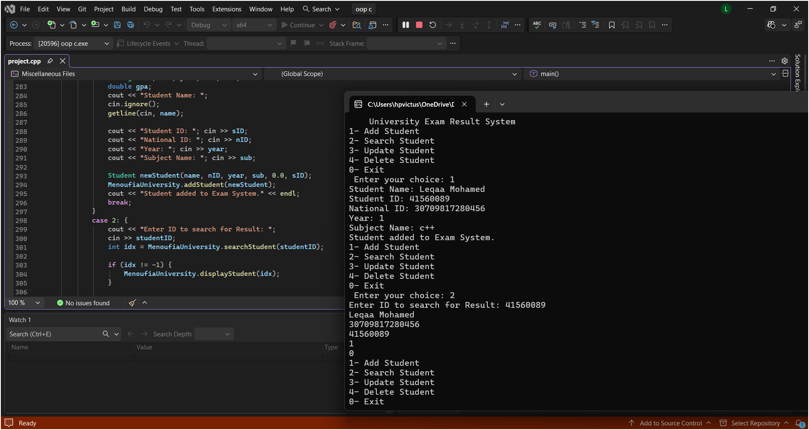

# University Exam Result System

A C++ OOP project for managing students and exam results using a menu-driven system.

## Features
- Add Student
- Search Student
- Update Student Data
- Delete Student

## System Demo

## Team Members
- Leqaa Mohamed
- Shahd Gamal
- Ereny Emad
- Nada Ibrahim
- Shaza Amr

## Language
C++
